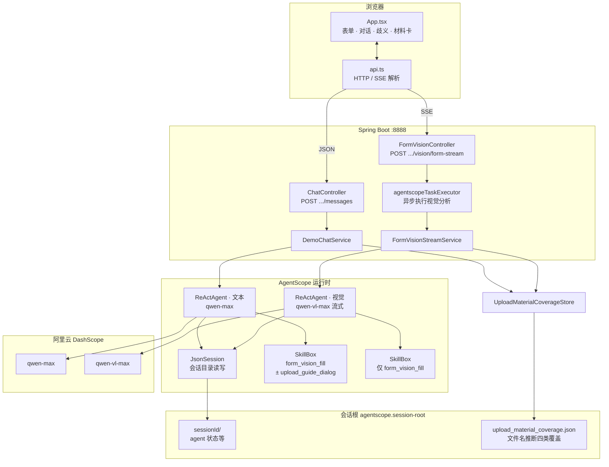
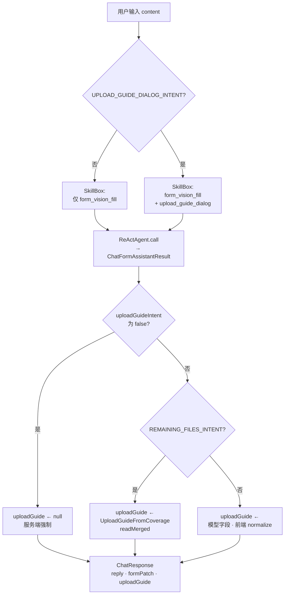
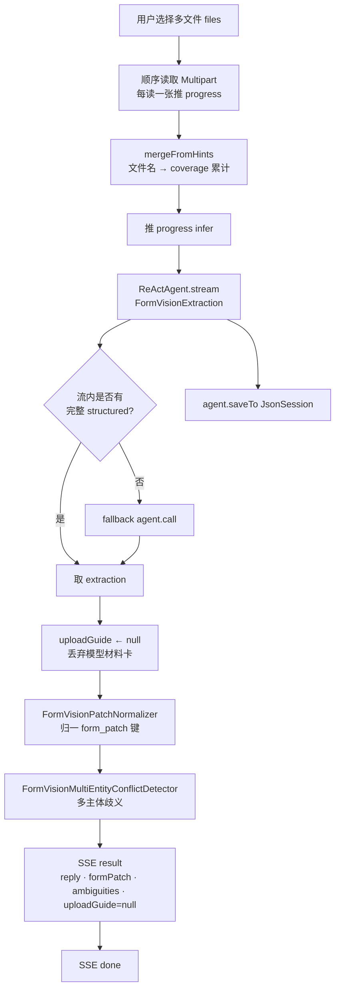
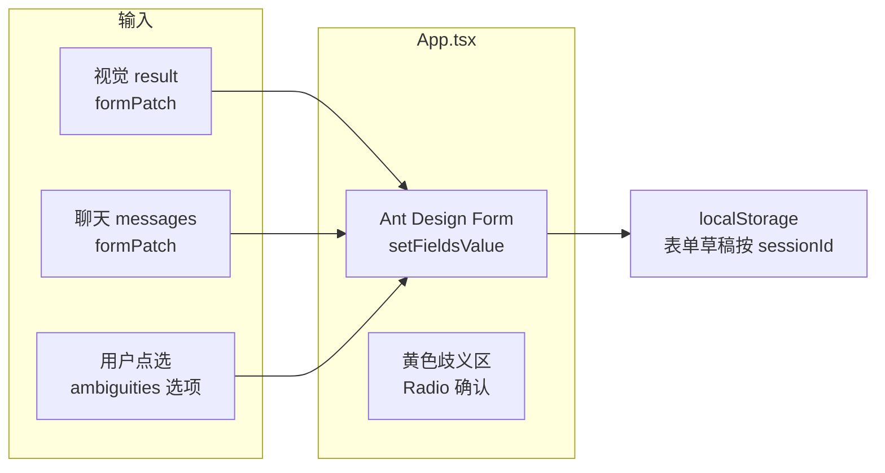

# multimodal-demo

企业工商与资质类 **结构化表单** 演示应用：左侧 **AgentScope Java** 智能对话（含多图视觉流式识别），右侧 **Ant Design** 表单；模型输出经 **camelCase `form_patch`** 回填，支持 **多主体营业执照歧义** 与 **材料清单卡片**（`upload_guide`）。

---

## 目录

- [功能概览](#功能概览)
- [架构流程图](#架构流程图)
- [核心功能流程图](#核心功能流程图)
- [技术栈与版本](#技术栈与版本)
- [仓库结构](#仓库结构)
- [环境要求](#环境要求)
- [配置说明](#配置说明)
- [运行方式](#运行方式)
- [会话与安全](#会话与安全)
- [HTTP API](#http-api)
- [多图视觉 SSE 协议](#多图视觉-sse-协议)
- [Agent、技能与业务规则](#agent技能与业务规则)
- [视觉结果后处理](#视觉结果后处理)
- [材料四类与样图资源](#材料四类与样图资源)
- [前端要点](#前端要点)
- [构建与测试](#构建与测试)
- [排错与注意事项](#排错与注意事项)

---

## 功能概览

| 能力 | 说明 |
|------|------|
| **文本对话** | 用户输入自然语言；模型返回 `reply`，可选 `form_patch`（表单键值子集），可选 `upload_guide`（材料卡）。阻塞式 HTTP，直至本轮模型结束。 |
| **多图视觉识别** | 对话区底部上传多张图片；服务端 **SSE** 推送读取进度、推理片段、流式摘要文本，最后下发 **`result`** JSON（`form_patch`、`ambiguities`、`reply`）。 |
| **歧义确认** | 多营业执照等不同主体冲突时，结构化 **`ambiguities`**；前端在表单上方展示选项，用户点选后再写入字段。 |
| **材料清单卡** | 由 `upload_guide` 驱动；与 **技能** 及 **服务端意图/覆盖推断** 对齐（见下文）。 |
| **会话持久化** | `JsonSession` 按 `sessionId` 落盘；文本 Agent 与视觉 Agent 可共用同一会话目录。 |
| **材料覆盖推断** | 基于 **上传文件名关键词** 累计四类证照是否「出现过」，写入 `upload_material_coverage.json`，供后续「还缺什么」类追问与卡片对齐（**非**图像内容识别）。 |

---

## 架构流程图

下图从**用户浏览器 → Spring → AgentScope → DashScope → 磁盘会话**分层展示主要组件与调用关系（省略异常路径与 health 等次要端点）。



**读图要点**

- **文本**与**视觉**使用**不同** `DashScopeChatModel` Bean，互不影响推理参数。  
- **视觉请求**在独立线程池执行，Servlet 线程只负责返回 `SseEmitter`。  
- **`JsonSession`** 为单例 Bean，文本与视觉共用同一**会话根**；**`UploadMaterialCoverageStore`** 按 `sessionId` 读写覆盖文件，供聊天侧「仍缺文件」与视觉侧「每次上传合并文件名」共用。

---

## 核心功能流程图

### 1. 文本对话（阻塞 HTTP）



与 `DemoChatService` 一致：先完成 **`call`**，再按 **`uploadGuideIntent` / `remainingFilesIntent`** 覆盖或清空 **`uploadGuide`**。

### 2. 多图视觉识别（SSE）



### 3. 表单回填与歧义交互（前端闭环）



---

## 技术栈与版本

| 组件 | 说明 |
|------|------|
| **JDK** | 17（`pom.xml` → `java.version`） |
| **Spring Boot** | 3.3.6 |
| **AgentScope Java** | `agentscope` 及相关扩展 `1.0.12`（见 `pom.xml`） |
| **DashScope** | 文本模型 **`qwen-max`**（非流式）；视觉 **`qwen-vl-max`**（流式），见 `DashScopeModelConfig` |
| **前端** | React 18、TypeScript 5.6、Vite 6、Ant Design 5；开发端口 **5173**，构建产物输出到 `src/main/resources/static/` |
| **Node（可选）** | `frontend-maven-plugin` 使用 Node **v20.18.0** / npm **10.8.2**（启用 `frontend` profile 时） |

---

## 仓库结构

```
multimodal-demo/
├── pom.xml                          # Maven：Spring Boot、AgentScope、可选前端构建
├── frontend/                        # Vite + React UI
│   ├── package.json
│   ├── vite.config.ts               # 代理 /api → 后端；outDir → ../src/main/resources/static
│   └── src/
│       ├── App.tsx                  # 主界面：表单、对话、视觉 SSE、歧义、材料卡
│       └── api.ts                   # HTTP/SSE、normalizeVisionUploadGuide、sanitizeAssistantReplyDisplay
├── src/main/java/io/agentscope/demo/
│   ├── app/
│   │   ├── MultimodalDemoApplication.java
│   │   ├── agent/                   # classpath 技能封装 → AgentSkill
│   │   ├── config/                  # DashScope、Web CORS、异步线程池、Agentscope 会话根路径
│   │   ├── service/
│   │   │   ├── DemoChatService.java         # 文本对话 + 意图路由 + upload_guide 覆盖逻辑
│   │   │   ├── FormVisionStreamService.java # 多图 SSE、patch 归一、多主体冲突检测、coverage 合并
│   │   │   ├── FormVisionPatchNormalizer.java
│   │   │   └── FormVisionMultiEntityConflictDetector.java
│   │   ├── upload/                  # 文件名推断四类证照、覆盖持久化、由覆盖构造仍缺 upload_guide
│   │   └── web/                     # REST：Chat、FormVision(SSE)、Health、DTO
│   └── SessionIds.java              # sessionId 白名单校验（防路径穿越）
├── src/main/resources/
│   ├── application.yml              # 端口、multipart 上限、agentscope、dashscope、logging
│   ├── skills/
│   │   ├── form_vision_fill.md      # 表单键、歧义、reply 章节骨架（不定义 upload_guide）
│   │   └── upload_guide_dialog.md   # upload_guide 白名单与卡片文案规则（仅文本意图命中时加载）
│   └── static/                      # `npm run build` 生成的前端静态资源（勿手改）
└── data/agentscope-sessions/        # 默认会话根（可通过配置覆盖）；每会话子目录含 agent 状态、coverage 等
```

仓库中另有已注释的 `FileController` 等「单文件任务」演示代码，**当前主流程以 `FormVisionController` SSE 为准**。

---

## 环境要求

- **JDK 17**、**Maven 3.8+**
- 有效 **DashScope API Key**（百炼 / 通义）
- 前端开发可选：**Node 20+**、npm

---

## 配置说明

### 1. `application.yml`（随仓库）

| 项 | 含义 |
|----|------|
| `server.port` | 默认 **8888** |
| `spring.servlet.multipart.max-file-size` / `max-request-size` | 单文件 **50MB**、整请求 **55MB** |
| `spring.config.import` | 可选加载同目录 **`application-local.yml`**（适合放密钥，勿提交 Git） |
| `agentscope.session-root` | 会话目录，默认 `data/agentscope-sessions`；可用环境变量 **`AGENTSCOPE_SESSION_ROOT`** 覆盖 |
| `dashscope.api-key` | API Key；**务必**用 **`DASHSCOPE_API_KEY`** 环境变量或 `application-local.yml` 覆盖仓库中的占位/示例值，**勿将真实密钥提交远程仓库** |
| `dashscope.vision-enable-thinking` | 视觉是否开启 extended thinking；`DashScopeProperties` 默认 `false`，仓库 `application.yml` 可能为 `true`（若遇 400 与 `thinking_budget` 相关，见[排错](#排错与注意事项)） |
| `dashscope.vision-thinking-budget` | 正整数预算；可用 **`DASHSCOPE_VISION_THINKING_BUDGET`** 覆盖 |

### 2. 推荐本地覆盖：`application-local.yml`

在项目根或工作目录放置（已在 `.gitignore` 中忽略则更安全）：

```yaml
dashscope:
  api-key: sk-your-real-key
```

或仅使用环境变量：

```bash
export DASHSCOPE_API_KEY=sk-your-real-key
export AGENTSCOPE_SESSION_ROOT=/path/to/sessions   # 可选
```

### 3. Vite 代理

`frontend/vite.config.ts` 中 **`VITE_PROXY_TARGET`** 默认 `http://localhost:8888`，与 Spring 默认端口一致。

---

## 运行方式

### A. 仅后端 + 已构建前端（默认 `frontend.skip=true`）

若 `src/main/resources/static/` 已有构建产物：

```bash
mvn -q spring-boot:run
```

浏览器打开：`http://localhost:8888/`（静态页由 Spring 托管）。

### B. 一条命令：Maven 内嵌安装 Node 并构建前端再运行

```bash
mvn -q -Pfrontend spring-boot:run
```

`-Pfrontend` 将 `frontend.skip` 设为 `false`，触发 `frontend-maven-plugin` 的 `npm install` 与 `npm run build`。

### C. 前后端分离开发（热更新）

1. 终端一：`mvn spring-boot:run`（8888）  
2. 终端二：`cd frontend && npm install && npm run dev`（5173）  

浏览器访问 **http://localhost:5173**；`/api` 由 Vite 代理到 8888。`WebConfig` 已对 `http://localhost:5173` 与 `127.0.0.1:5173` 放开 **`/api/**`** 的 CORS。

---

## 会话与安全

- 所有需 `sessionId` 的 API 路径参数均经 **`SessionIds.requireSafeSessionId`**：
  - 非空、最大长度 **128**
  - **仅允许** `[a-zA-Z0-9_-]+`
  - **禁止** `..`、`/`、`\`
- 前端通常使用 **UUID** 作为会话 id；请勿传入任意文件路径片段。

---

## HTTP API

| 方法 | 路径 | 说明 |
|------|------|------|
| `GET` | `/api/health` | 存活探测，返回 `{"status":"UP"}` |
| `POST` | `/api/sessions/{sessionId}/messages` | 文本对话；`Content-Type: application/json`，body 为 **`ChatRequest`**（字段 `content`：用户正文） |
| `POST` | `/api/sessions/{sessionId}/vision/form-stream` | 多图视觉；`multipart/form-data`，重复字段名 **`files`**；响应 **`text/event-stream`**（SSE） |

### `POST .../messages` 响应体（`ChatResponse`）

- **`reply`**：字符串，助手主文案  
- **`formPatch`**：对象或 `null`，camelCase 键 → 表单值  
- **`serverTime`**：服务端时间  
- **`uploadGuide`**：对象或 `null`，材料卡（见 DTO `UploadGuideDto` / 前端 `VisionUploadGuide`）

### `ChatRequest`

```json
{ "content": "用户输入的纯文本" }
```

---

## 多图视觉 SSE 协议

- **Controller**：`FormVisionController`；`SseEmitter` 超时 **30 分钟**；**禁止**在 Servlet 线程内同步执行 `runAnalysis`（由 **`agentscopeTaskExecutor`** 异步执行）。
- **Content-Type**：`text/event-stream`；每条事件为 SSE **`data:`** 后接 **单行 JSON**（前端按行 `JSON.parse`）。

### 事件 `type` 一览

| `type` | 典型字段 | 说明 |
|--------|-----------|------|
| `progress` | `phase`：`load_image` \| `infer`；`done`、`total`、`label`、`fileName`（读图阶段） | 读图进度或进入推理阶段提示 |
| `thinking` | `delta` | 推理片段增量（来自 `ThinkingBlock` 等） |
| `assistant_text` | `delta` | 汇总/结果通道的文本增量 |
| `result` | `reply`、`formPatch`、`ambiguities`、`uploadGuide` | **最终结构化结果**；其中 **`uploadGuide` 服务端固定为 `null`**（视觉链路不产出材料卡） |
| `done` | — | 流正常结束 |
| `error` | `message` | 错误说明；连接随后关闭 |

流结束若仍无完整结构化体，`FormVisionStreamService` 会 **fallback** 再 `agent.call` 一次；仍失败则返回占位 `reply`。

---

## Agent、技能与业务规则

### 共同基础

- **`ReActAgent`** + **`SkillBox`** 注册 classpath 技能；结构化输出类型由路由区分（文本：`ChatFormAssistantResult`；视觉：`FormVisionExtraction`）。
- **`JsonSession`**：`agent.loadIfExists` / `saveTo`，目录为 `{sessionRoot}/{sessionId}/`。

### 技能一：`form_vision_fill`（`src/main/resources/skills/form_vision_fill.md`）

- **职责**：`form_patch` 的 **camelCase 键**、日期 **ISO-8601**、**`ambiguities`**（视觉）、**`reply`** 的 **【】四段章节骨架**（识别概要 / 已抽取字段 / 待确认·歧义 / 未覆盖说明）。
- **不职责**：不定义 **`upload_guide`** JSON；不在此技能中加载上传引导类规则。

### 技能二：`upload_guide_dialog`（`src/main/resources/skills/upload_guide_dialog.md`）

- **职责**：四种证照 **`sample_image_id`** 与中文 **`title`** 白名单、`upload_guide` 卡片字段语义、`reply` 中与上传/缺件/样例相关的表述约束等。
- **加载时机（与代码一致）**：**仅**在 **`DemoChatService`** 中，当用户当前条消息匹配 **`UPLOAD_GUIDE_DIALOG_INTENT`** 正则时，才 **`registerSkill(UploadGuideDialogSkillSupport)`**；否则 **不注册**该技能，且系统提示要求 **`upload_guide` 必须为 null**。

### 文本对话中 `upload_guide` 的最终形态（`DemoChatService`）

1. **未命中** `UPLOAD_GUIDE_DIALOG_INTENT`：响应中的 **`uploadGuide` 强制为 `null`**（丢弃模型可能误填的结构化字段）；`reply` 不应引导「见下方材料卡片」。
2. **命中**且**未**匹配 **`REMAINING_FILES_INTENT`**（泛泛「如何使用」「需要什么材料」等）：使用模型返回的 `upload_guide`（前端再做 `normalizeVisionUploadGuide`）。
3. **命中**且匹配 **`REMAINING_FILES_INTENT`**（「还缺哪些文件」等）：**服务端忽略模型**的 `upload_guide`，改为 **`UploadGuideFromCoverage.buildRemaining(readMerged(sessionId))`**，与 **文件名累计覆盖** 严格一致。

系统提示在「仍缺文件」分支会把 **`UploadMaterialCoverageStore.readMerged`** 的已推断/未推断证照中文列表注入模型，便于 **`reply`** 与卡片一致。

### 视觉链路 `upload_guide`（`FormVisionStreamService`）

- **不注册** `upload_guide_dialog`。
- 用户消息与 **sysPrompt** 明确要求：**仅** `form_vision_fill`；**`upload_guide` 恒为 null**。
- 在发出 `result` 前执行 **`extraction.uploadGuide = null`**，防止模型偶发输出材料卡。

### 视觉上传与覆盖文件

- 每张图读完并取原始文件名列表后，调用 **`uploadMaterialCoverageStore.mergeFromHints(safeId, names)`**。
- **`MaterialFilenameInference`** 从文件名推断四类 **`MaterialSampleIds`**，合并写入会话目录下 **`upload_material_coverage.json`**（与图像识别结果独立，仅作「是否上传过某类文件名」的弱信号）。

---

## 视觉结果后处理

在 SSE 下发 **`result`** 之前，对 **`FormVisionExtraction`** 做：

1. **`FormVisionPatchNormalizer.normalize`**  
   - 将模型输出的别名键、错误前缀键等映射到与前端 **`Form.Item` `name`** 一致的 **`CANONICAL_KEYS`** 白名单。  
   - 剔除白名单外字段，避免 `setFieldsValue` 静默丢键。

2. **`FormVisionMultiEntityConflictDetector.apply`**  
   - 在归一化 **之后** 执行；针对多证 **企业名称 / 统一社会信用代码** 等互斥信号，从 `form_patch` 中移除冲突键并填充 **`ambiguities`**，与技能 `form_vision_fill` 中的多主体规则一致。

---

## 材料四类与样图资源

与 **`MaterialSampleIds`**、`upload_guide_dialog`、前端 **`frontend/public/samples/`** 对齐：

| `sample_image_id` | 中文全称（卡片 `title`） | 示意文件（构建后由静态资源提供） |
|---------------------|---------------------------|-----------------------------------|
| `BUSINESS_LICENSE` | 营业执照 | `samples/business-license.png` |
| `ID_CARD_FRONT` | 身份证人像面 | `samples/id-card-front.png` |
| `ROAD_TRANSPORT_PERMIT` | 道路危险货物运输许可证 | `samples/road-transport-permit.png` |
| `SAFETY_PRODUCTION_PERMIT` | 危险化学品经营许可证 | `samples/safety-production-permit.png` |

前端 **`api.ts`** 中：

- **`normalizeVisionUploadGuide`**：校验 id、去重、在特定 `card_title` / 条数条件下 **补全为四条** `missing_items` 等（与产品「首次四卡」体验对齐）。
- **`sanitizeAssistantReplyDisplay`**：展示前移除 Markdown 图片语法、常见「（如适用）」等，减少裂图与冗余后缀。
- **`resolveSampleImageUrl`**：将 `sample_image_id` 映射为上述路径。

UI 上缩略图叠加 **「样图」** 角标（见 `App.css`）。

---

## 前端要点

- **入口**：`frontend/src/main.tsx` → `App.tsx`。
- **会话 id**：页面加载时用 **`crypto.randomUUID()`** 生成一次，整页生命周期内固定；API 路径均带该 id。表单草稿通过 **`localStorage`** 键前缀 `FORM_STORAGE_PREFIX + sessionId` 读写（见 `App.tsx`），**并非**把 sessionId 单独持久化为另一键名。
- **视觉**：`postVisionFormStream` 使用 **`fetch` + `ReadableStream`** 解析 SSE；合并 `delta` 更新推理区与识别说明；`result` 后应用 `formPatch`、`ambiguities`，**忽略** `uploadGuide`（后端已为 null）。
- **聊天**：`postJson` 调 `messages`；若有 `uploadGuide` 则经 `normalizeVisionUploadGuide` 后渲染 **`UploadGuideCardSection`**。

---

## 构建与测试

```bash
# Java 编译
mvn -q compile -DskipTests

# 单元测试
mvn -q test

# 仅前端类型检查与生产构建
cd frontend && npm ci && npm run build
```

与 **`FormVisionPatchNormalizer`**、**`FormVisionMultiEntityConflictDetector`** 等相关的测试位于 `src/test/java/...`。

---

## 排错与注意事项

1. **DashScope API Key**  
   未配置或无效时，应用可能启动失败或调用报错；请使用 **`DASHSCOPE_API_KEY`** 或 `application-local.yml`。

2. **视觉 extended thinking**  
   `DashScopeModelConfig` 注释说明：`qwen-vl-max` 在部分百炼参数组合下与 **正 `thinking_budget`** 不兼容可能返回 **400**。若出现类似错误，在配置中将 **`dashscope.vision-enable-thinking`** 设为 **`false`** 或调整预算，并阅读 `DashScopeSupport` / 官方文档。

3. **`sessionId` 400**  
   检查是否含非法字符或路径片段。

4. **SSE 在开发代理下缓冲**  
   Vite 已对 `text/event-stream` 响应设置 **`x-accel-buffering: no`** 等，仍异常时可直连 8888 对比。

5. **材料卡与「仍缺」不一致**  
   「还缺」类追问的卡片以 **`upload_material_coverage.json`**（文件名推断）为准，而非上一轮视觉模型口头描述。

---

## 相关类速查

| 主题 | 主要类 / 文件 |
|------|----------------|
| 文本对话 | `DemoChatService`, `ChatController`, `ChatFormAssistantResult`, `ChatResponse` |
| 视觉 SSE | `FormVisionStreamService`, `FormVisionController`, `FormVisionExtraction` |
| 技能加载 | `FormVisionFillSkillSupport`, `UploadGuideDialogSkillSupport` |
| 技能正文 | `src/main/resources/skills/*.md` |
| Patch / 歧义 | `FormVisionPatchNormalizer`, `FormVisionMultiEntityConflictDetector` |
| 覆盖与仍缺卡 | `UploadMaterialCoverageStore`, `MaterialFilenameInference`, `UploadGuideFromCoverage`, `MaterialSampleIds` |
| 模型 Bean | `DashScopeModelConfig`, `DashScopeProperties` |
| 会话路径 | `AgentscopeProperties`、`AgentscopeSessionConfig`（注册 `JsonSession`、启动时创建会话根目录） |

---

维护 README 时，若行为与代码不一致，**以 Java / TypeScript / `application.yml` 为准**，并同步更新本表与各节描述。
