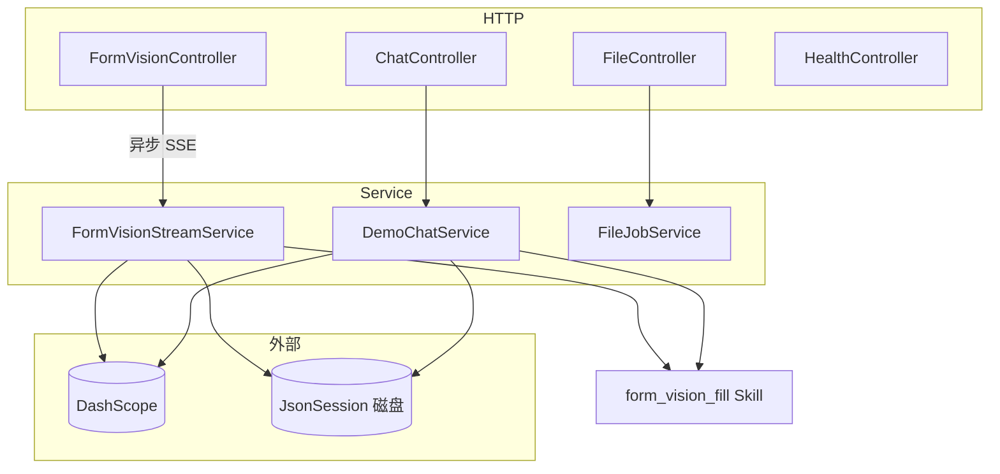

# `io.agentscope.demo.app` 模块说明

本包为 **multimodal-demo** 的 Spring Boot 应用层：基于 **AgentScope**（`ReActAgent`、Skill、`JsonSession`）与 **阿里云 DashScope**（`qwen-max` / `qwen-vl-max`），对外提供 **会话内文本对话**、**多图表单视觉识别（SSE 流式）** 等 HTTP API，并与前端 Ant Design 表单字段（camelCase）对齐。

> 根入口类：`MultimodalDemoApplication`（扫描 `io.agentscope.demo` 全包）。

---

## 1. 包内目录结构

| 路径 | 职责 |
|------|------|
| `MultimodalDemoApplication.java` | Spring Boot 启动、启用调度、启动后 `[boot]` 锚点日志 |
| `config/` | Bean 与外部化配置：DashScope 模型、磁盘 `JsonSession`、SSE 用线程池、CORS 等 |
| `web/` | REST 控制器与统一异常；`web/dto/` 为请求/响应与结构化输出 DTO |
| `service/` | 业务实现：视觉流、文本对话、（演示用）单文件假任务 |
| `agent/` | 从 classpath 加载 `form_vision_fill` 技能，供多链路透传 |

**非本包但强相关**：`io.agentscope.demo.SessionIds` 对 URL 中的 `sessionId` 做安全校验；技能正文在 `classpath:/skills/form_vision_fill.md`（与前端字段约定一致）。

---

## 2. 架构与依赖关系（简图）

---

## 3. 核心业务流程

### 3.1 多图 + 表单视觉（主链路）

1. 客户端 `POST /api/sessions/{sessionId}/vision/form-stream`，`multipart/form-data`，字段名 `files` 可多个。
2. `FormVisionController` 先返回 `SseEmitter`，在 **`agentscopeTaskExecutor`** 线程中调用 `FormVisionStreamService.runAnalysis`，避免阻塞 Tomcat 工作线程。
3. 服务内：`SessionIds.requireSafeSessionId` → 读入各图 → SSE 推送 `progress`（`load_image` / `infer`）→ 组装多模态 `Msg`（说明文字 + 多图 Base64）→ 注册技能 **`form_vision_fill`** → `ReActAgent#stream` 将事件映射为 `thinking` / `assistant_text`；若流内出现结构化数据则收集 `FormVisionExtraction`。
4. 若流结束仍无结构化体，**兜底**再 `agent.call(userMsg, FormVisionExtraction.class)`。
5. 向客户端发送 `result`（`reply`、`formPatch`、`ambiguities`），`agent.saveTo(jsonSession, sessionId)`，再 `done` 并关闭连接。
6. 异常时发送 `error` 事件并 `completeWithError`；日志前缀多为 **`[vision]`** / **`[vision-sse]`**。

**SSE 事件类型（JSON，每帧 `data: {...}\n\n`）**

| `type` | 含义 |
|--------|------|
| `progress` | 读图或推理阶段进度 |
| `thinking` | 推理片段增量 `delta` |
| `assistant_text` | 摘要/答复文本增量 `delta` |
| `result` | 最终结构化：`reply`、`formPatch`、`ambiguities` |
| `done` | 正常结束 |
| `error` | 可读错误信息 `message` |

### 3.2 会话内文本对话

1. `POST /api/sessions/{sessionId}/messages`，JSON `ChatRequest`（用户正文）。
2. `DemoChatService`：同样加载 **`form_vision_fill`**，构建 `ReActAgent`，`loadIfExists` → `call(..., ChatFormAssistantResult.class)` → `saveTo`。
3. 返回 `ChatResponse`：`reply` + 可选 `formPatch`；模型/基础设施异常在业务层吞掉并返回可读文案，HTTP 仍为 200（避免前端只看状态码误判）。日志前缀 **`[chat]`** / **`[chat-http]`**。

### 3.3 演示：单文件「解析任务」（与 AgentScope 主链路无关）

- `POST /api/files/analyze`：上传单文件，内存登记假任务，返回 `jobId`。
- `GET /api/files/{jobId}`：轮询百分比与步骤条数据；进程重启任务丢失。

### 3.4 其它

- `GET /api/health`：存活探测，固定 `{"status":"UP"}`。
- `ApiExceptionHandler`：如 `IllegalArgumentException` → 400 `ProblemDetail`；上传超限 → 413。

---

## 4. 数据与持久化

- **会话持久化**：`JsonSession` 根目录由 `agentscope.session-root` 决定（默认 `data/agentscope-sessions`，可用环境变量 `AGENTSCOPE_SESSION_ROOT` 覆盖）。`sessionId` 经 `SessionIds` 校验后作为子目录名，防路径穿越。
- **结构化输出**：
  - 视觉：`FormVisionExtraction`（`form_patch` / `ambiguities` / `reply`）。
  - 对话：`ChatFormAssistantResult`（`form_patch` / `reply`）。

歧义项 DTO 为 `AmbiguousFieldDto` + `AmbiguousOptionDto`，与前端「单选确认后写回表单」约定一致。

---

## 5. 配置要点（与 `src/main/resources/application.yml` 配合）

| 前缀 / 项 | 说明 |
|-----------|------|
| `dashscope.api-key` | 必填；推荐 `DASHSCOPE_API_KEY` 环境变量 |
| `dashscope.vision-enable-thinking` | 视觉模型是否开 extended thinking；**qwen-vl-max 默认应 false**，否则易 400 |
| `dashscope.vision-thinking-budget` | 仅在开启 thinking 时生效 |
| `agentscope.session-root` | `JsonSession` 磁盘根路径 |
| `spring.servlet.multipart.*` | 上传大小上限（多图场景） |

本地可 `optional:file:./application-local.yml` 覆盖敏感项（勿提交仓库）。

---

## 6. Web 与并发

- **CORS**：`WebConfig` 对 `/api/**` 放行 `localhost:5173` / `127.0.0.1:5173`（Vite 开发联调）；生产需按域名收紧。
- **线程池**：`agentscopeTaskExecutor`（有界队列）执行视觉长任务；详见 `AgentscopeAsyncConfig`。

---

## 7. 模型 Bean（`DashScopeModelConfig`）

| Bean 名 | 用途 | 模型 |
|---------|------|------|
| `chatDashScopeChatModel` | 文本对话 `call` | `qwen-max` |
| `formVisionDashScopeChatModel` | 多图视觉 `stream` | `qwen-vl-max`（流式；thinking 由配置控制） |

---

## 8. 日志检索（便于回溯）

应用包默认可将 `io.agentscope.demo.app` 设为 `DEBUG`。典型前缀：

- `[boot]`、`[dashscope]`、`[async]`：启动与基础设施  
- `[vision]`、`[vision-sse]`：多图视觉全链路  
- `[chat]`、`[chat-http]`：文本对话  
- `[file-demo]`、`[file-job]`：演示文件任务  
- `[api]`：全局异常处理器  

---

## 9. 扩展阅读

- AgentScope Java 文档：可通过项目配置的 MCP `user-agentscope-docs` 拉取。
- 前端联调：Vite 默认代理到后端（见 `frontend/vite.config.ts`），后端静态资源来自 `classpath:/static/`（前端 `npm run build` 产物）。
